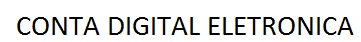

<p align="center">
  
</p>

Demonstração do Projeto em produção: [Clique aqui](http://78.47.200.77:5001/) 

## Execução do projeto
```
git clone https://github.com/willmont1982/ctdig.git
cd ctdig
docker-compose up --build -d
```
## Sobre
A Aplicação CtDigBF simula um banco digital, contendo a área do cliente da agência e area administrativa onde o mesmo podera fazer depósitos e transferências.
Desenvolvimento na IDE Visual Studio 2019, em Asp.Net Core 3, C#, JavaScript, CSS, HTML, Banco de Dados MongoDB e Framework AngularJs 8. Autenticação JWT Token. Serviço de mensagem em fila RabbitMQ.
- Aplicação multi plataformas devido a escalabilidade de algumas classes e módulos serem mais funcionais em determinadas linguagens e scripts.

## Acesso da Aplicação com CNPJ e Senha:

CNPJ: 03569262000160

Senha: 123456

FrontEnd: Via endpoint http://localhost:5001/
API BackEnd: Via endpoint http://localhost:5002/

## Iniciando o projeto
- Na tela de inicio da aplicação pela primeira devera ser cadastrado a agência junto com user admin.
- Criando a conta o cliente ficará pendente até que o admin aprove o seu cadastro.
- Caso aprove ou recuse, um evento de envio de simulação de e-mail sera emitido avisando o cliente.
- Aprovando, cria-se uma conta junto ao cliente sem saldo.
- Disponibilidade de depositos online que ao cadastrado ficará como pendente, efetuado posteriormente.
- Clientes realizarão uma transferência para outras contas solicitando a transferência ela ficará como pendente, sendo adicionada posteriormente ou cancelada.
- Depósito ou transferência forem cancelados será disparado um evento simulando o envio de e-mail notificando os clientes.
- Depósito ou transferência forem efetuados sem restrição, a movimentação sera dada como OK.

## Informações extras do projeto
- Moedas em centavos convertidas em reais para o cliente
- A cada transação terá 30 segundos de espera para uma nova.
- O projeto pode levar alguns segundos para iniciar, pois o serviço de filas do RabbitMQ possui um delay. 
- Testes unitários Rest utilizando Postman.

## Autor

* Willian Roberto Montrezol - [GitHub](https://github.com/willmont1982)
